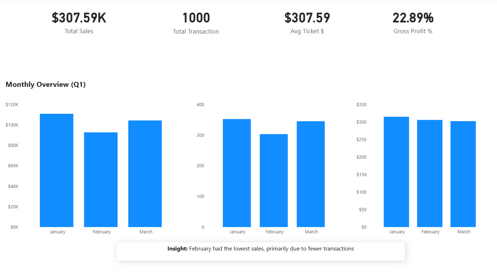
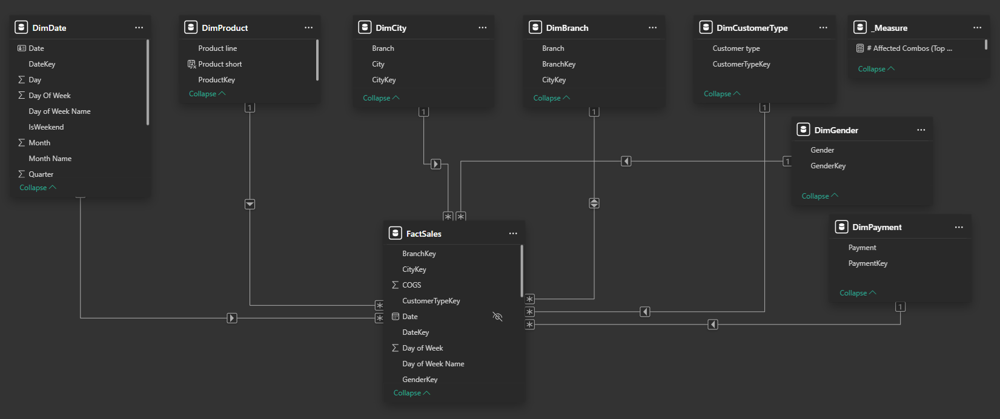
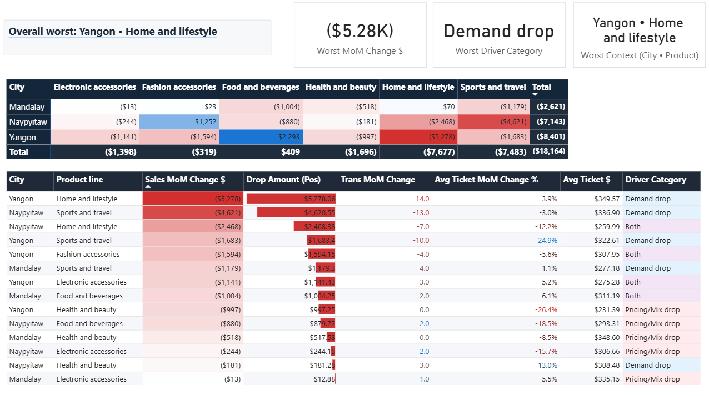
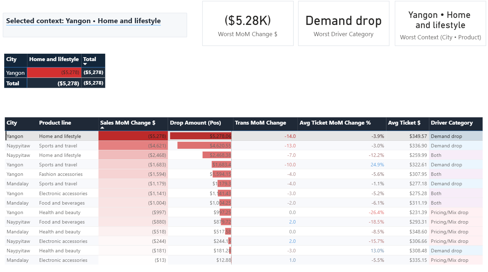
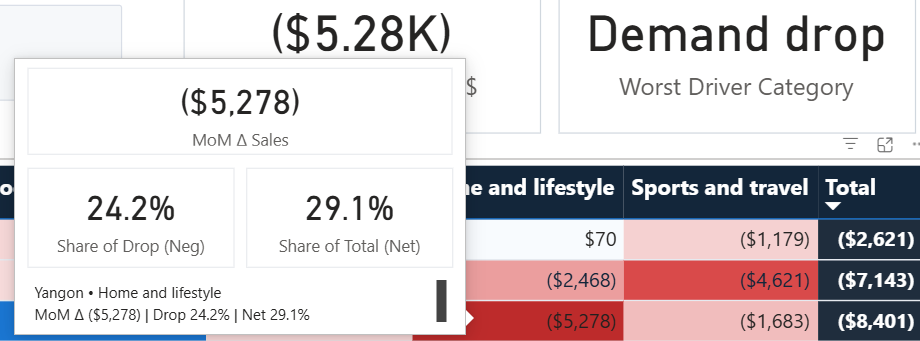
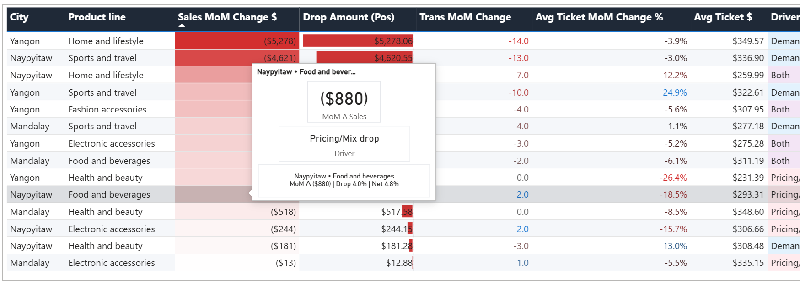

# Power BI Sales Performance Analysis (Supermarket Dataset)

Built an end-to-end sales performance analysis project in Power BI with a strong focus on data cleaning, financial metric reconstruction, and root-cause diagnostics (not just visuals).

## Key insight
February sales decline was driven mainly by fewer transactions (demand drop), while average spend per transaction stayed relatively stable — indicating a demand-driven dip rather than pricing issues.

## What I built
- Power Query cleaning & standardization
- Reconstructed metrics: Sales, COGS, Gross Profit, Gross Margin %
- Star Schema modeling + validated relationships
- DAX measures for MoM analysis and contribution logic
- Root Cause page (Matrix + Table) with two Tooltips:
  - Tooltip – Root Cause (Matrix)
  - Tooltip – Root Cause (Table)

## Report pages
- Overview
- Product Line
- Branch and City
- Root Cause
- Tooltip – Root Cause (Matrix)
- Tooltip – Root Cause (Table)

## Screenshots

### 1) Overview (KPIs + Q1 trend)

### 2) Data model (Star schema)

### 3) Product Line Drivers (Feb vs Jan)
.png)

### 4) Root Cause (Overall worst context)

### 5) Root Cause (Selected cell + drill table)

### 6) Tooltip – Root Cause (Matrix)

### 7) Tooltip – Root Cause (Table)

## Files
- `pbix/Sales Analysis.pbix`
- `data/SuperMarket Analysis.csv`
- `screenshots/` (project images)
